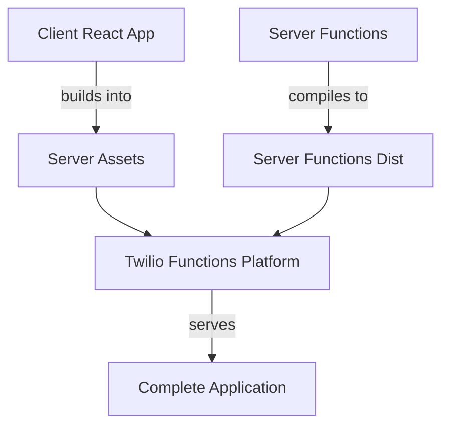

# Twilio Conversations Demo - Full Stack Application

 

## Overview

This is a complete full-stack Twilio Conversations demo application built as a monorepo. It demonstrates how to build a modern chat application with:

- **React Frontend** - Modern UI built with Twilio Paste design system
- **Serverless Backend** - Twilio Functions for authentication and event handling  
- **Integrated Deployment** - Single command deploys both client and server to Twilio platform

The application allows users to create and join conversations, add participants, exchange messages, and includes support for media sharing and push notifications. All authentication and conversation management is handled through the integrated Twilio serverless functions.

### How It Works

1. **Client** builds into the server's assets folder
2. **Server** provides authentication tokens and handles conversation events
3. **Single deployment** to Twilio Functions serves both the React app and API endpoints
4. **Users authenticate** with the built-in token service and connect to Twilio Conversations

## Get Started

### Prerequisites

- Node.js 20+
- [Twilio CLI](https://www.twilio.com/docs/twilio-cli/quickstart) installed and configured
- Twilio Account with Conversations Service

### Environment Setup

1. **Clone and install dependencies:**
   ```bash
   git clone <your-repo-url>
   cd twilio-conversations-demo-react
   npm install
   ```

2. **Configure server environment:**
   
   Create `server/.env` with your Twilio credentials:
   ```env
   ACCOUNT_SID=your_twilio_account_sid
   TWILIO_API_KEY_SID=your_api_key_sid
   TWILIO_API_KEY_SECRET=your_api_key_secret
   SERVICE_SID=your_conversations_service_sid
   PUSH_CREDENTIAL_SID=your_push_credential_sid  # Optional
   ```

3. **⚠️ CRITICAL SECURITY**: Change default passwords in `server/src/get-access-token.ts`:
   ```typescript
   const users: Record<string, string> = {
       user00: "your_secure_password_1",  // Change from "00resu"
       user01: "your_secure_password_2"   // Change from "10resu"  
   };
   ```

### Development Build and Run

Start both client and server for development:

```bash
# Start development servers (client on :3000, server on :3003)
npm run dev
```

This runs:
- React development server with hot reload
- Twilio Functions local server 
- Client connects to local server for tokens

### Deploy Build and Run  

Build and deploy the complete application:

```bash
# Build both client and server, deploy to Twilio Functions
npm run deploy
```

This process:
1. Builds React app into server assets
2. Compiles TypeScript server functions  
3. Deploys everything to Twilio Functions platform
4. Your app is live at your Twilio Functions domain

### Production Testing Locally

Test the production build locally before deploying:

```bash
# Build everything and run locally
npm run start
```

Visit `http://localhost:3003` to test the complete application.

## Generating Access Tokens

The application includes a built-in token service that authenticates users and generates Twilio access tokens.

### Default Test Users

The demo includes two test users:
- **Username**: `user00`, **Password**: `00resu` (default - **MUST CHANGE**)
- **Username**: `user01`, **Password**: `10reresu` (default - **MUST CHANGE**)

### 🔒 Security Configuration

**BEFORE DEPLOYING TO PRODUCTION:**

1. **Change passwords** in `server/src/get-access-token.ts`
2. **Restrict CORS** origins from `*` to your domain
3. **Implement proper user management** - current system is for demo only

### Required Twilio Configuration

Set up these resources in your Twilio Console:

1. **Conversations Service** - [Create here](https://www.twilio.com/console/conversations/services)
2. **API Keys** - [Create here](https://www.twilio.com/console/project/api-keys) 
3. **Push Credentials** (Optional) - [Create here](https://www.twilio.com/console/project/credentials/push-credentials)

## Architecture

### Monorepo Structure

```
twilio-conversations-demo-react/
├── client/                    # React application
│   ├── src/                  # React components and logic
│   ├── public/               # Static assets  
│   └── package.json          # Client dependencies
├── server/                   # Twilio Functions
│   ├── src/                  # TypeScript serverless functions
│   ├── dist/                 # Compiled output
│   │   ├── functions/        # Deployed serverless functions
│   │   └── assets/           # Built React app (auto-generated)
│   └── package.json          # Server dependencies  
├── package.json              # Root workspace configuration
└── CHANGELOG.md              # Version history
```

### Deployment Architecture



### Centralized Build System (v2.1.0+)

All build commands are centralized at the root level for simplified development:

**Main Commands:**
- `npm run build` - **Full build**: cleans, builds client to server assets, compiles server TypeScript
- `npm run start` - **Build + start**: complete build then starts local server on port 3003
- `npm run deploy` - **Build + deploy**: complete build then deploys to Twilio Functions
- `npm run dev` - **Development**: same as `npm run start` (build + local server)

**Individual Build Steps:**
- `npm run clean` - Removes server/dist directory
- `npm run build:client` - Builds React app to `../server/dist/assets`  
- `npm run build:server` - Compiles TypeScript server functions

**Other Commands:**
- `npm run test` - Run all tests
- `npm run lint` - Lint client code

## Features

### Client Application
- Modern React UI with Twilio Paste design system
- Real-time messaging and conversation management
- Media file sharing and message reactions
- Push notification support (with Firebase setup)
- Responsive design for mobile and desktop

### Server Functions  
- **Authentication**: Token generation with user credentials
- **Event Handling**: Webhook processing for conversation events  
- **Asset Serving**: Integrated React app hosting
- **CORS Support**: Cross-origin request handling

### Development Experience
- **Monorepo**: Unified dependency management
- **TypeScript**: Full type safety across client and server
- **Hot Reload**: Live development with automatic rebuilds
- **Single Deploy**: One command deployment process

## Push Notifications (Optional)

To enable push notifications, set up Firebase:

1. **Create Firebase project** at [Firebase Console](https://firebase.google.com)
2. **Enable Cloud Messaging API (Legacy)** in project settings
3. **Create Twilio Push Credential** using Firebase Server Key
4. **Configure client** by replacing `public/firebase-config.example` with your `firebase-config.js`
5. **Add credential SID** to your `server/.env` as `PUSH_CREDENTIAL_SID`

## Troubleshooting

### Common Issues

**Build Failures**: Ensure Node.js 20+ and all dependencies installed
**Authentication Errors**: Verify Twilio credentials in `server/.env`  
**CORS Issues**: Check server function CORS configuration
**Token Failures**: Ensure API keys have Conversations grants

### Local Development
- Client runs on `http://localhost:3000` 
- Server runs on `http://localhost:3003`
- React dev server proxies API calls to local server

### Production Deployment
- Everything served from single Twilio Functions domain
- Client assets served from root path
- API endpoints at `/get-access-token`, `/post-event`, etc.

## Migration Notes

### From v2.0.x to v2.1.0

Version 2.1.0 introduces improved build system and TypeScript compatibility:
- **Centralized build commands** - All build orchestration moved to root package.json
- **Fixed TypeScript issues** - Resolved serverless runtime types and import compatibility  
- **Simplified workflow** - Single `npm run start` command builds and runs everything
- **Better dependency management** - Proper serverless runtime types dependency added

### From v1.x to v2.x

Version 2.0.0 represents a major architectural change from standalone React app to integrated full-stack monorepo. See [CHANGELOG.md](CHANGELOG.md) for complete migration details.

Key changes:
- All client code moved to `client/` directory  
- Server functions added for authentication and events
- Unified build and deployment process
- Single Twilio Functions deployment target

## License

MIT